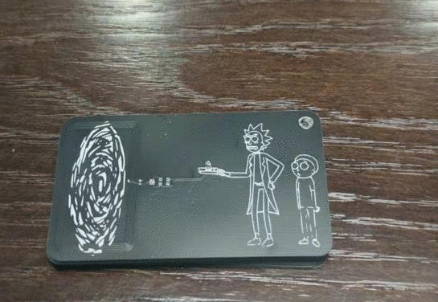
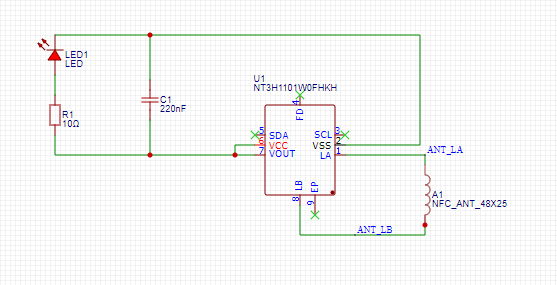
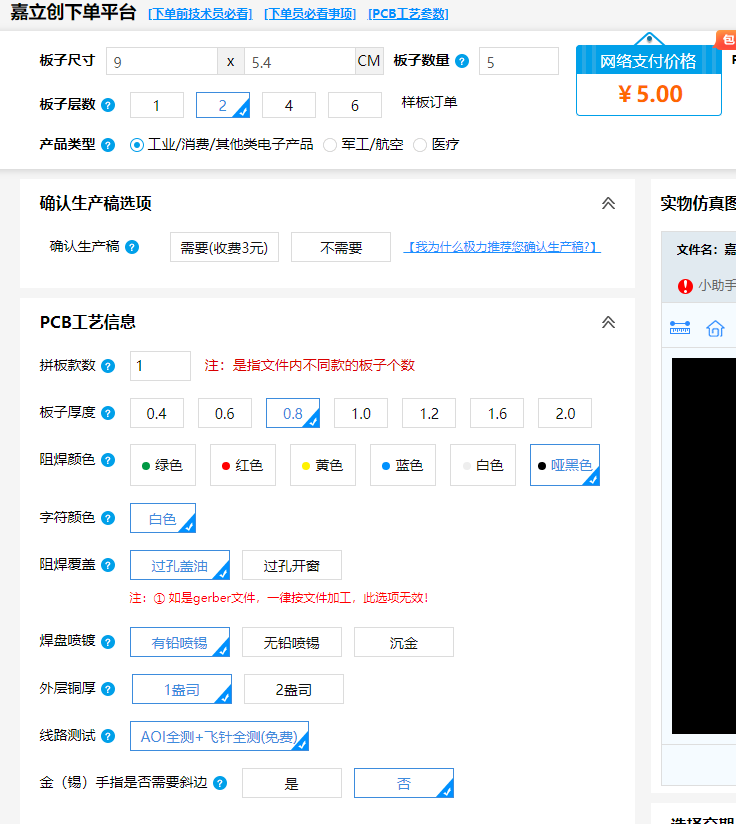
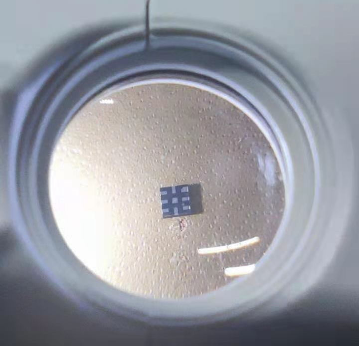
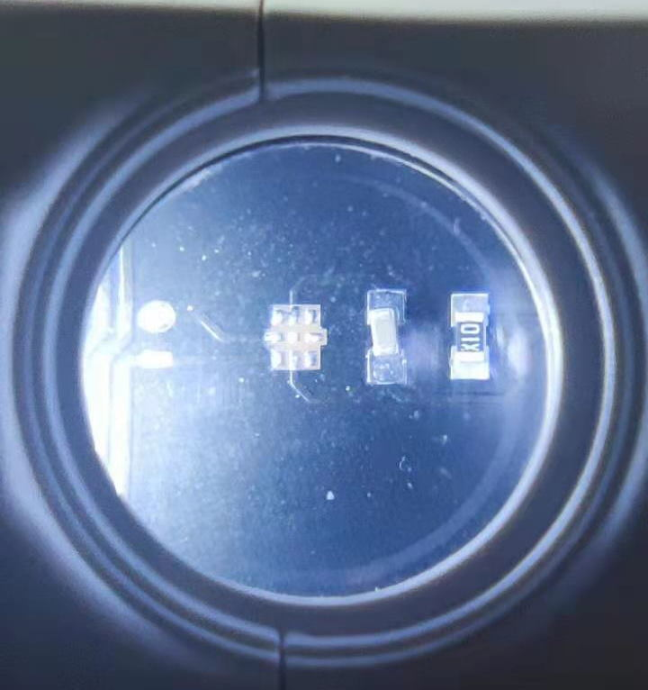
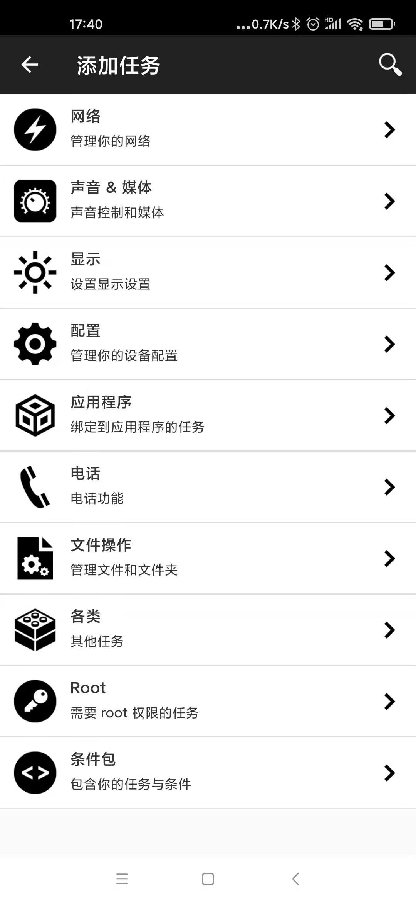

# NFC 电子名片

其实使用NFC在手机上的应用也差不多有十来年了，而用NFC来做一个电子名片已经不是什么稀罕事。前两个星期无意中在著名的创客分享网站 [instructables](https://www.instructables.com/) 上看到[一篇写的非常详细的文章](https://www.instructables.com/PCB-Business-Card-With-NFC/) ,干脆就照着他的方案来做一个吧。

## 基本原理

其实很简单啦。。。NFC线圈感应到信号后产生的电能存储到电容中，再放电出来点亮LED灯。在这里需要注意的其实就两点：

- 线圈的设计，线圈的尺寸圈数等等完全会影响NFC芯片感应的性能。当然，这种事儿也不用太费脑筋，其实NXP已经给出了参考方案。这个项目中的线圈也完全是按照NXP的方案中来进行的。
- 电容、电阻、LED等的选型，通过以上线圈方案其实可以计算出最终所需要的电容大小为220nF。原项目方案中采用了黄色的LED灯和47Ω的电阻。不过为了更好的配合瑞克的传送枪的风格，我这里选用了绿色的LED灯，所以将电阻降低到了10Ω。

基本原理图如下：

## 制作流程

### PCB板的设计（可忽略）

如果您愿意自己从头来设计的话，可以参考该原理图或者直接到[立创EDA](https://lceda.cn/)上直接导入我的[立创EDA的文件](1.Schematic/NFC名片_2021-03-03.json)。
需要注意的是， 您在立创EDA上自行设计PCB时如果要选择线圈，请找别人已经设计好的48X25规格的NFC线圈。同时，这些线圈的元件封装（可能是由于跨层或者其他原因）导致无法无法正常连接天线的焊盘和NFC芯片的网络，所以需要手工忽略规则。
同时，为了避免PCB两面的丝印层上器件周围的丝印边框，需要将这些器件打散然后再删除丝印。

## 下单制作

如果您设计完PCB版，或者直接使用我的“2.Gerber”文件夹中的Gerber文件下单。如果是在[嘉立创](https://www.jlc.com/#)下单，那么我建议使用0.8mm厚度的板子。太厚的板子太难看，而太薄的板子又太贵。这个标准名片尺寸的板子5.4*9cm大小，5块钱包邮可以做5片还要什么自行车呢？

## 采购器件

BOM列表参见"3.BOM"，只用到了4个元器件,单个元器件成本价格不到5元。

| 类别 | 型号 | 封装 | 单价 | 备注 |
| ---- | ---- | ---- | ---- | ---- |
| NFC芯片 | [NT3H1101W0FHKH](https://item.szlcsc.com/74269.html) | XQFN-8 | 4.77元 | |
| 电容 | [220nF](https://item.szlcsc.com/315946.html) | 0603 | 0.066442元 |嘉立创一次下单最少50个， 3.32元|
| 电阻 | [10Ω](https://item.szlcsc.com/23586.html) | 0603 | 0.008618元 | 嘉立创一次下单最少100个，0.86元 |
| LED | [绿色](https://item.szlcsc.com/88504.html) | 0603 | 0.147718元 | 嘉立创一次下单最少20个， 2.95元|

## 焊接

其实对于0603封装的器件来说，用普通电烙铁手稳一点还是能搞定。但是对于XQFN-8封装的这枚NXP的NFC芯片来说基本不可能了。在长宽1.6mm的芯片底部密密麻麻布满了9个焊点，如下图所示（得用放大镜了，不然根本拍不清楚）。

- 所以我建议的焊接方式是使用低温焊锡膏配合热风枪。首先将PCB板上焊盘位置用小刷子刷上一点助焊剂。

- 然后在焊盘上涂抹一点点低温焊锡膏，将器件摆到对应的位置。

- 用热风枪来加热，靠焊锡膏融化时形成的液面张力自动的将芯片对齐位置，必要的时候用尖嘴镊子辅助一下，最后轻轻的用镊子将NFC芯片压紧挤出底部多余的焊锡。在这个步骤我就不方便拍摄了，这里需要提醒的是热风枪的风量一定要尽可能的小。不要像我一样热风枪凑上去直接将几个器件吹跑了。 ╮(╯▽╰)╭

## NFC 的使用

有很多可以向NFC芯片里写数据的软件，包括NXP自己也有一个TagWriter。不过还是Play Store里的 "NFC Tools"最好用。需要注意的是，国内某些商店里有个叫做“NFC Tool”的不要混淆了。这枚NFC芯片里大概能写入不到1Kb的数据，所以可以写入纯文本，也可以是URL，也可以是VCard信息，这样和别人交换名片时对方手机一扫就可以讲你的联系信息存入对方的手机。

当然，随着手机的支持可以做的事情远远不止这些。好好玩玩“NFC Tools”甚至可以用它做出一些和手机联动的功能。

## 看完了？动手做一个呗
